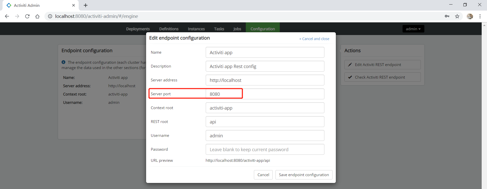

# Activiti 6.x 整合 Spring Boot 2.x

[TOC]

## 一、遇到问题

### 1. Spring Boot 整合 Activiti 报错 [processes/] 不存在

<https://blog.csdn.net/qq_21770005/article/details/78969146>

### 2. Activiti6 use spring-boot-starter-web meet requestMappingHandlerMapping error

@SpringBootApplication(exclude = SecurityAutoConfiguration.class)

<https://hub.alfresco.com/t5/alfresco-process-services/activiti6-use-spring-boot-starter-web-meet/m-p/125303>

### 3. java.sql.SQLException: The server time zone value 'Öйú±ê׼ʱ¼ä' is unrecognized or represents more than one time zone.

加上 serverTimezone=GMT%2B8 参数

```
jdbc:mysql://127.0.0.1:3306/activiti-spring-boot?characterEncoding=UTF-8&serverTimezone=GMT%2B8
```

### 4. mysql-connector-mysql 8.0 (spring-boot-starter-parent 管理的版本) + Activiti 6.x 自动建表失败

[深入分析mysql 6.0.6 和 activiti 6.0.0自动创建表失败的问题](https://blog.csdn.net/jiaoshaoping/article/details/80748065)

解决方案 加上 nullCatalogMeansCurrent=true 参数

```
jdbc:mysql://127.0.0.1:3306/activiti-spring-boot?characterEncoding=UTF-8&serverTimezone=GMT&nullCatalogMeansCurrent=true
```

## 二、Activiti WAR 包简介

### 1. Activiti 5.x 提供的 activiti-explorer

> 账号 kermit 密码 kermit

explorer 相当于 admin + app。

### 2. Activiti 6.x 提供的 activiti-admin

> 账号 admin 密码 admin

修改端口，8080 或者 9999，依据自己 tomcat 的部署情况。



可以看到 URL preview 调用的是 activiti-app （如果提示要输入账号密码，记得输入 activiti-app 的，而不是 activiti-admin）

#### 1) 功能简介

**Deployments**

  提供了流程定义部署文件列表查看，流程定义上传等功能。

  流程定义部署文件列表字段：ID, Name, Deploy time, Category 和 Tenant (租户)。

**Definitions **

  提供了流程定义列表查看。

  流程定义列表字段：ID, Name, Version, Key 和 Tenant (租户)。

**Instances**

  提供了流程实例列表查看。

  流程实例列表字段：ID, Business Key (**业务 Key，一般是业务表的主键 ID**), Process definition, Created 和 Ended。

**Tasks**

  提供了流程任务列表查看。

  流程任务列表字段：ID, Name. Assignee (办理人), Owner, Created, Ended, Priority (优先级)。

**Jobs**

  ？？？？。

  ？？？？列表字段：ID, Due date, Process definition, Retries 和 Exception。

**Configuration**

  ？？？？。

  ？？？？。

### 3. Activiti 6.x 提供的 activiti-app

> 账号 admin 密码 test

主要提供 **流程图绘制** 和 **表单绘制**。

### 4. Activiti 提供的 activiti-rest

> 账号 kermit 密码 kermit

